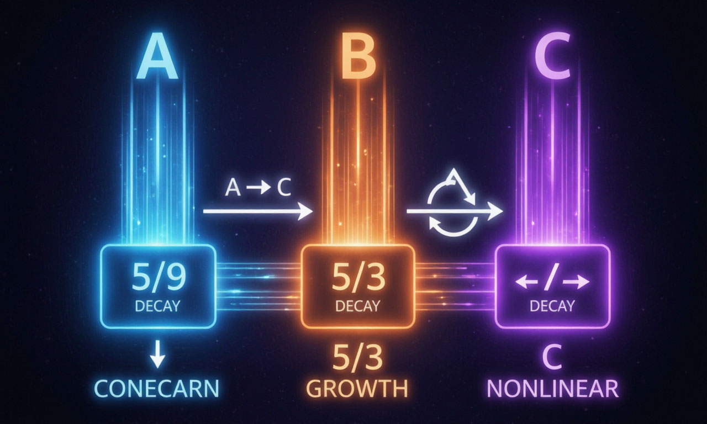

[](https://github.com/MSHUNKO101/perfect_random/actions/workflows/msbuild.yml)
[](https://github.com/MSHUNKO101/perfect_random/releases)
[](https://github.com/MSHUNKO101/perfect_random/releases)
[](LICENSE)


# CascadePRNG — генератор псевдослучайных чисел

Каскадный генератор псевдослучайных чисел с пермутацией ролей компонент.
Разработан как отечественное решение для замены `rand()` и `std::mt19937`
в задачах генерации данных, моделирования и статистических расчётов.



## Принцип работы

### Базовый генератор — CascadePRNG

Три внутренние переменные `(a, b, c)` — целые числа в диапазоне `[1, 2³¹−2]`.
На каждом шаге каждая переменная преобразуется по своему правилу:

| Переменная | Операция | Описание |
|:---|:---|:---|
| `a` | `a × 5/9 mod M` | Затухание |
| `b` | `b × 5/3 mod M` | Рост |
| `c` | `c² + a + b mod M` | Нелинейность + смешивание |

где `M = 2³¹ − 1` (простое число Мерсенна).

Множители `5/9` и `5/3` не подобраны эмпирически — они заданы математической
моделью каскада. В модульной арифметике реализованы через обратные элементы
по модулю M.

### Пермутация ролей

Каждые `N` шагов происходит пермутация — циклический сдвиг ролей:
`(a, b, c) → (c, a, b)`. Переменная, которая была затуханием, становится
нелинейностью, та — ростом, та — снова затуханием.

После трёх пермутаций роли возвращаются к исходным. Это **гарантированный
цикл по построению**, независимый от модуля.

Значение `N` по умолчанию — **49** для базового генератора. Внутри главного
класса `RNG` каждое ядро использует своё значение: `48`, `49` и `50`
соответственно — это снижает корреляцию между ядрами.

### Вывод

```
output = (a × b + c) mod M
```

Смешивание всех трёх компонент связывает их в выходном значении и устраняет
смещение, характерное для линейных генераторов. Результат приводится
к диапазону `[0, 1)` делением на `M`.


## Архитектура RNG

Поверх `CascadePRNG` построен многоуровневый генератор `RNG` с тремя ядрами:

```
                 ┌──────────────────────┐
                 │         RNG          │
                 │  (главный класс)     │
                 └──────┬───────────────┘
                        │
        ┌───────────────┼───────────────┐
        ▼               ▼               ▼
┌──────────────┐ ┌─────────────┐ ┌──────────────┐
│ AssocCore    │ │ MeanCore    │ │ FantasyCore  │
│ генерация    │ │ нормализация│ │ коррекция    │
│ CascadePRNG  │ │ по среднему │ │ коллизий     │
│ N=48         │ │ N=49        │ │ N=50         │
└──────────────┘ └─────────────┘ └──────────────┘
```

| Ядро | Назначение |
|:---|:---|
| **AssociativityCore** | Первичная генерация случайного значения. Хранит состояние для автоматического ризида. |
| **MeanCore** | Нормализация к целевому среднему с добавлением случайного шума. |
| **FantasyCore** | Адаптивная коррекция: отслеживает коллизии между значениями и корректирует выход на основе битовых различий. |

### Дополнительно

- **Детекция коллизий** — буфер на 49 значений, перегенерация при совпадении (до 49 попыток).
- **Автоматический ризид** — срабатывает по геометрическому периоду или при исчерпании попыток. Новое зерно выводится из текущего состояния.
- **Каскадное порождение зёрен** — под-зёрна для ядер не берутся напрямую, а порождаются через временный CascadePRNG (64 бита из двух 32-битных выходов).

### Геометрический период ризида

Период ризида вычисляется из геометрии трёхмерного пространства: задаются
три точки (A, B, O), рассчитывается угол между векторами OA и OB, угловая
скорость и период вращения:

\$$[
\omega = \frac{\angle AOB}{t_{AB}}, \qquad T = \frac{2\pi}{\omega}
\$$]

При `period = 73.8` лет это даёт ~ $\(5 \times 10^{13}\)$ шагов до ризида —
генератор работает на одном каскаде практически всё время.


## Отличия от известных генераторов

| Генератор | Линейность | Компонент | Пермутация | Множители |
|:---|:---:|:---:|:---|:---|
| LCG (MINSTD) | Линейный | 1 | нет | подобраны |
| MRG | Линейный | 3–5 | нет | подобраны |
| Mersenne Twister | Линейный | 624 | битовая | подобраны |
| xorshift | Линейный | 3 | битовая | подобраны |
| AES-CTR | Нелинейный | блок | байтовая | стандартиз. |
| **CascadePRNG** | **Нелинейный** | **3** | **ролей** | **из модели** |

Ключевое отличие — пермутация меняет **роли операций**, а не данные.


## Результаты тестов

### Базовые проверки

| Тест | Результат |
|:---|:---|
| Воспроизводимость | PASS |
| Чувствительность к seed | PASS |
| Seed = 0 | PASS |
| Диапазон [0, 1) | PASS |
| Среднее (~0.5) | PASS |
| СКО (~0.2887) | PASS |
| Chi-square (10 корзин) | PASS |
| Автокорреляция (lag 1–5) | PASS |
| Monobit (частота бит) | PASS |
| Runs (серии) | PASS |
| Пермутация ролей | PASS |
| N не меняется при generate | PASS |
| N влияет на последовательность | PASS |
| Период > 10M | PASS |

### BigCrush (TestU01)

> **В процессе.** Прогон 106 тестов BigCrush — золотой стандарт
> статистического тестирования ГПСЧ. Запущен параллельно на нескольких ядрах.

| Параметр | Значение |
|:---|:---|
| Батарея | BigCrush (TestU01) |
| Пройдено | 28 / 106 |
| Статус | 🟡 в процессе |
| Seed | 42 |
| Period | 73.8 |

Результаты обновляются по мере прохождения.


## Использование

### Один файл, ничего лишнего

```cpp
#include "perfect_random.hpp"

int main() {
    RNG rng(42, 73.8);   // seed=42, period=73.8 лет

    for (int i = 0; i < 100; i++) {
        double val = rng.generate();   // [0.0, 1.0)
        std::cout << val << "\n";
    }
}
```

### Параметры

| Параметр | Тип | Описание |
|:---|:---|:---|
| `seed` | `unsigned int` | Начальное зерно (0 → 1) |
| `period` | `double` | Период вращения в годах (для ризида) |


## Лицензия

Разработано в Республике Беларусь.
Оригинальная реализация, не использующая сторонние библиотеки.


Когда BigCrush добьёт все 106 — просто замените `28 / 106` на `106 / 106` и статус на `🟢 PASS`. Если что-то завалится — пометите конкретный тест. Удачи с прогоном!
